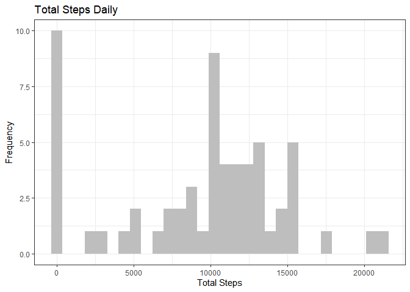
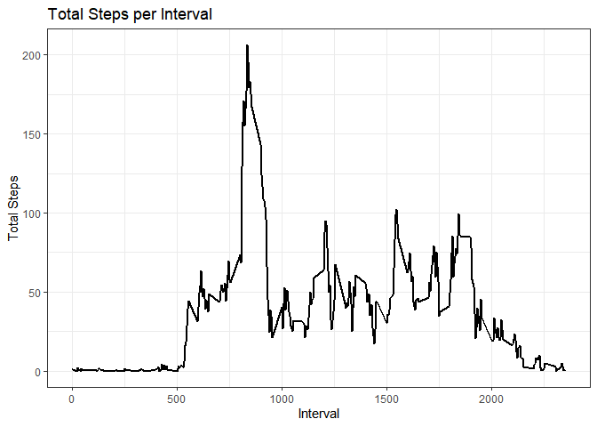
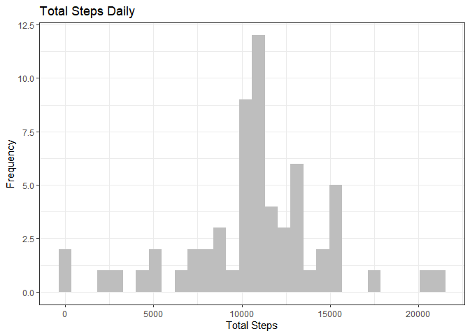
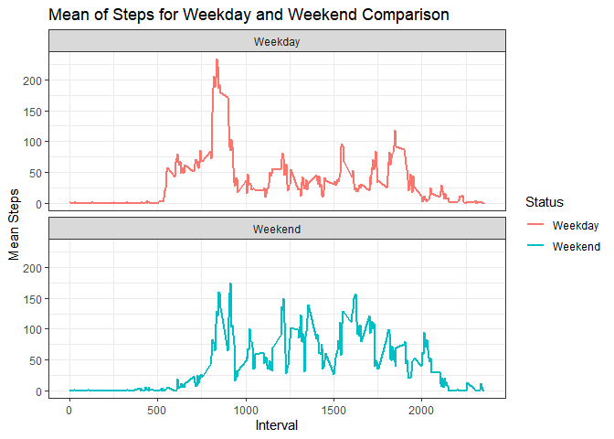

Reproducible Research JHU Project 01
================
Gito
2024-10-05

# Reproducible Research Project 01 on COursera

## Introduction

It is now possible to collect a large amount of data about personal
movement using activity monitoring devices such as a Fitbit, Nike
Fuelband, or Jawbone Up.

These type of devices are part of the “quantified self” movement – a
group of enthusiasts who take measurements about themselves regularly to
improve their health, to find patterns in their behavior, or because
they are tech geeks.

This assignment makes use of data from a personal activity monitoring
device. This device collects data at 5 minute intervals through out the
day. The data consists of two months of data from an anonymous
individual collected during the months of October and November, 2012 and
include the number of steps taken in 5 minute intervals each day.

The data for this assignment can be downloaded from the course web
site: - Dataset: \[Activity Monitoring Data\]
(<https://d396qusza40orc.cloudfront.net/repdata%2Fdata%2Factivity.zip>)
The variables included in this dataset are: - Steps: Number of steps
taking in a 5-minute interval (missing values are coded as NA) - Date:
The date on which the measurement was taken in YYYY-MM-DD format -
Interval: Identifier for the 5-minute interval in which measurement was
taken

# Below are the project task and step

## Loading and preprocessing the data

### Import csv file from local directory

#### Import all necessary library and transform dataset

``` r
# Import Dataset and store to variable activity
library(ggplot2)
library(tidyverse)
```

    ## ── Attaching core tidyverse packages ──────────────────────── tidyverse 2.0.0 ──
    ## ✔ dplyr     1.1.4     ✔ readr     2.1.5
    ## ✔ forcats   1.0.0     ✔ stringr   1.5.1
    ## ✔ lubridate 1.9.3     ✔ tibble    3.2.1
    ## ✔ purrr     1.0.2     ✔ tidyr     1.3.1
    ## ── Conflicts ────────────────────────────────────────── tidyverse_conflicts() ──
    ## ✖ dplyr::filter() masks stats::filter()
    ## ✖ dplyr::lag()    masks stats::lag()
    ## ℹ Use the conflicted package (<http://conflicted.r-lib.org/>) to force all conflicts to become errors

``` r
library(dplyr)
```

#### Read csv from local directory and transform data

``` r
activity <- read.csv("activity.csv", header = TRUE, sep = ",")
activity$date <- as.Date(activity$date,"%Y-%m-%d")
```

## What is mean total number of steps taken per day?

1.  Calculate the total number of steps taken per day

``` r
# Summarize steps and group by date as sum and exclude NA from calculation
step_summary <- activity|> group_by(date)|> summarise(sum(steps,na.rm = TRUE))
names(step_summary) <- c("Date","Total_Steps")
head(step_summary)
```

    ## # A tibble: 6 × 2
    ##   Date       Total_Steps
    ##   <date>           <int>
    ## 1 2012-10-01           0
    ## 2 2012-10-02         126
    ## 3 2012-10-03       11352
    ## 4 2012-10-04       12116
    ## 5 2012-10-05       13294
    ## 6 2012-10-06       15420

2.  If you do not understand the difference between a histogram and a
    barplot, research the difference between them. Make a histogram of
    the total number of steps taken each day

``` r
ggplot(step_summary,aes(x=Total_Steps)) + 
  geom_histogram(fill = "gray")+
  theme_bw()+ 
  labs(x="Total Steps",y="Frequency",title = "Total Steps Daily")
```

    ## `stat_bin()` using `bins = 30`. Pick better value with `binwidth`.

<!-- -->

3.  Calculate and report the mean and median of the total number of
    steps taken per day

``` r
Mean_Median <- list(avg_step = mean(step_summary$Total_Steps),
                    median_step = median(step_summary$Total_Steps))
Mean_Median
```

    ## $avg_step
    ## [1] 9354.23
    ## 
    ## $median_step
    ## [1] 10395

## What is the average daily activity pattern?

1.  Make a time series plot (i.e. type = “l”type = “l”) of the 5-minute
    interval (x-axis) and the average number of steps taken, averaged
    across all days (y-axis)

``` r
interval_summary <- activity|> group_by(interval)|> summarise(mean(steps,na.rm = TRUE))
names(interval_summary) <- c("Interval","Steps")
ggplot(interval_summary,aes(x=Interval,y=Steps))+
  geom_line(linewidth = 1)+theme_bw()+
  labs(x= "Interval",y = "Total Steps",title = "Total Steps per Interval")
```

<!-- -->

2.  Which 5-minute interval, on average across all the days in the
    dataset, contains the maximum number of steps?

``` r
## filter top max steps value and select 1st column (which is interval)
head(interval_summary|>arrange(desc(Steps)),1)[,1]
```

    ## # A tibble: 1 × 1
    ##   Interval
    ##      <int>
    ## 1      835

## Imputing missing values

1.  Calculate and report the total number of missing values in the
    dataset (i.e. the total number of rows with NA)

``` r
sum(is.na(activity$steps) == "TRUE")
```

    ## [1] 2304

2.  Devise a strategy for filling in all of the missing values in the
    dataset. The strategy does not need to be sophisticated. For
    example, you could use the mean/median for that day, or the mean for
    that 5-minute interval, etc.

``` r
## We will replace NA with mean of whole data 
activity$steps[is.na(activity$steps)] <- mean(activity$steps,na.rm = TRUE)
```

3.  Create a new dataset that is equal to the original dataset but with
    the missing data filled in.

``` r
# export cleaned dataset to csv format and save to local directory
write.csv(activity,file = "activitytidy.csv",row.names = FALSE)
```

4.  Make a histogram of the total number of steps taken each day and
    Calculate and report the mean and median total number of steps taken
    per day. Do these values differ from the estimates from the first
    part of the assignment? What is the impact of imputing missing data
    on the estimates of the total daily number of steps?

``` r
step_summary <- activity|> group_by(date)|> summarise(sum(steps))
names(step_summary) <- c("Date","Total_Steps")
ggplot(step_summary,aes(x=Total_Steps)) + 
  geom_histogram(fill = "gray")+
  theme_bw()+ 
  labs(x="Total Steps",y="Frequency",title = "Total Steps Daily")
```

    ## `stat_bin()` using `bins = 30`. Pick better value with `binwidth`.

<!-- -->

``` r
Mean_Median <- list(avg_step = mean(step_summary$Total_Steps),
                    median_step = median(step_summary$Total_Steps))

# New Mean and Median after NA cleaning
Mean_Median
```

    ## $avg_step
    ## [1] 10766.19
    ## 
    ## $median_step
    ## [1] 10766.19

``` r
# Previous Mean and Median prior to NA cleaning 
## $avg_step
## [1] 9354.23
## 
## $median_step
## [1] 10395
```

### We can see difference in mean and median after NA cleaning

## Are there differences in activity patterns between weekdays and weekends?

For this part the weekdays() weekdays() function may be of some help
here. Use the dataset with the filled-in missing values for this part.

1.  Create a new factor variable in the dataset with two levels –
    “weekday” and “weekend” indicating whether a given date is a weekday
    or weekend day.

``` r
## Create new factor variable weekend and weekdays
## Reimport dataset
activity <- read.csv("activity.csv", header = TRUE, sep = ",")
activity$date <- as.Date(activity$date,"%Y-%m-%d")
names(step_summary) <- c("Date","Total_Steps")
activity$Dayname <- weekdays(activity$date)
## Create new variable Wend_Wday with value "Weekday" and we ll replace Saturday and Sunday with mutate function
activity$Wend_Wday <- "Weekday"
activity <- activity |> mutate(Wend_Wday = ifelse(Dayname == "Saturday" | Dayname == "Sunday","Weekend",Wend_Wday))
head(activity)
```

    ##   steps       date interval Dayname Wend_Wday
    ## 1    NA 2012-10-01        0  Monday   Weekday
    ## 2    NA 2012-10-01        5  Monday   Weekday
    ## 3    NA 2012-10-01       10  Monday   Weekday
    ## 4    NA 2012-10-01       15  Monday   Weekday
    ## 5    NA 2012-10-01       20  Monday   Weekday
    ## 6    NA 2012-10-01       25  Monday   Weekday

2.  Make a panel plot containing a time series plot (i.e. type = “l” of
    the 5-minute interval (x-axis) and the average number of steps
    taken, averaged across all weekday days or weekend days (y-axis).
    See the README file in the GitHub repository to see an example of
    what this plot should look like using simulated data.

``` r
interval_summary <- activity|> group_by(interval,Wend_Wday)|> mutate(avg_step = mean(steps,na.rm = TRUE))
ggplot(interval_summary,aes(x=interval,y=avg_step,colour = Wend_Wday)) + 
  geom_line(linewidth = 0.8)+
  facet_wrap(~Wend_Wday,ncol=1,nrow=2) + 
  labs(x="Interval",y="Mean Steps", title = "Mean of Steps for Weekday and Weekend Comparison",color = "Status")+
  theme_bw()
```

<!-- -->

### We can see the pattern difference between weedays and weekend
